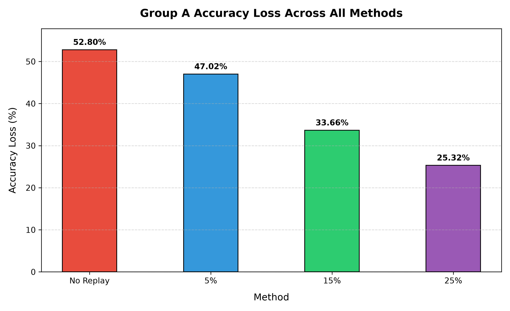

# Aprendizaje federado continuo

Proyecto de prácticas para estudiar el olvido catastrófico en modelos de clasificación de imágenes entrenados de forma federada y secuencial. Los experimentos comparan el entrenamiento sin memoria con diferentes capacidades de **replay buffer**, reutilizando muestras de la primera tarea al aprender la segunda.

## Funcionamiento

Los scripts simulan clientes en un único proceso: cada cliente entrena una copia del modelo global y se agregan sus parámetros mediante una media entre clientes. Utilizan ResNet-18 adaptada a imágenes pequeñas, optimización Adam y pérdida de entropía cruzada.

1. Entrenar sobre el grupo o dominio A.
2. Continuar sobre B, incorporando muestras de A cuando se utiliza replay.
3. Evaluar la precisión en ambos grupos y medir cuánto se pierde en A.

La pérdida de precisión se calcula como `precisión de A antes de B - precisión de A después de B`, en puntos porcentuales. Los porcentajes del buffer corresponden a la proporción de muestras de A conservadas por cada cliente.

## Experimentos disponibles

| Archivo | Contenido |
| --- | --- |
| `step_four.py` | Experimento inicial con CIFAR-100: clases 0–49 como grupo A y 50–99 como grupo B, sin replay. |
| `step_six_v1.py` | CIFAR-100 con buffers del 0 %, 5 %, 10 %, 15 % y 20 %; repite la fase A para cada buffer. |
| `three_buffer_size.py` | Igual que el anterior con buffers del 0 % al 25 %. |
| `three_buffer_v2.py` | Entrena la fase A una vez y compara buffers del 0 % al 25 % desde esos mismos pesos. |
| `cifar100_three_buffer.py` | Comparación de CIFAR-100 con 0 %, 5 %, 10 %, 15 %, 20 % y 25 % de replay, tablas y gráficos. |
| `domainnet.py` | Cambio de dominio de imágenes reales a bocetos con las primeras 10 clases de DomainNet y buffers del 0 %, 5 %, 10 %, 15 %, 20 % y 25 %. |
| `mvtecad_all_experiments.py` | Clasificación de las 15 categorías de MVTec AD, divididas en grupos de 7 y 8; compara buffers del 0 %, 5 %, 10 %, 15 %, 20 % y 25 %, y estima su tamaño en disco y en tensores. |

En MVTec AD las etiquetas representan categorías de objetos o texturas; el experimento evalúa clasificación de categorías, no detección ni localización de anomalías.

## Instalación y Entorno

El proyecto cuenta con un contenedor Docker oficial (`cfl-practicas`) que resuelve automáticamente todas las dependencias y evita incompatibilidades de Windows con librerías nativas.

### Requisitos previos
- Tener **Docker Desktop** instalado y abierto en Windows.

Si necesitas reconstruir la imagen Docker o el volumen de caché de Hugging Face:
```powershell
docker build -t cfl-practicas .
docker volume create cfl-hf-cache
```

## Ejecución

### Forma rápida y recomendada (Menú interactivo o scripts directos)

Se incluyen scripts lanzadores automáticos que gestionan los contenedores y volúmenes sin que tengas que escribir comandos largos:

- **Desde el explorador de Windows o CMD**:
  - Haz doble clic en `run.bat` (o `ejecutar.bat`) para abrir un menú interactivo con todos los experimentos.
  - O ejecuta directamente cualquier archivo desde la terminal:
    ```cmd
    run.bat test
    run.bat step_four.py
    run.bat cifar100_three_buffer.py
    ```

- **Desde PowerShell**:
  ```powershell
  .\run.ps1
  .\run.ps1 test
  .\run.ps1 step_four.py
  ```

- **Desde VS Code / Cursor**:
  - Pulsa `Ctrl + Shift + B` y selecciona el experimento deseado o "Ejecutar Archivo Actual en Docker".

- **Con Docker Compose**:
  ```powershell
  docker compose run --rm cfl python step_four.py
  ```

### Ejecución manual tradicional en contenedor

```powershell
docker run --rm -v "${PWD}:/workspace" -v cfl-hf-cache:/cache/huggingface -w /workspace cfl-practicas python step_four.py
docker run --rm -v "${PWD}:/workspace" -v cfl-hf-cache:/cache/huggingface -w /workspace cfl-practicas python cifar100_three_buffer.py
docker run --rm -v "${PWD}:/workspace" -v cfl-hf-cache:/cache/huggingface -w /workspace cfl-practicas python domainnet.py
docker run --rm -v "${PWD}:/workspace" -v cfl-hf-cache:/cache/huggingface -w /workspace cfl-practicas python mvtecad_all_experiments.py
```

Los valores por defecto están en el diccionario `CONFIG` de cada script: número de clientes, tamaño de lote, épocas locales, rondas, tasa de aprendizaje, semilla y dispositivo. La semilla por defecto es 42 para Python, NumPy y PyTorch; CIFAR-100 también la pasa a Flower Datasets. cuDNN queda en modo determinista.

Todos los experimentos de replay aceptan estos argumentos (módulo común `experiment_common.py`):

| Argumento | Efecto |
| --- | --- |
| `--seed N` | Cambia la semilla. Para conclusiones, repite con varias (ver más abajo). |
| `--buffers 0 5 10 ...` | Porcentajes a comparar. El 0 % (sin replay) es obligatorio y **siempre se mide**; ya no hay referencias escritas a mano. |
| `--rounds N`, `--local-epochs N` | Sobrescriben rondas y épocas locales. |
| `--equal-steps` | Mismo número de actualizaciones en todas las variantes: el replay sustituye parte de los lotes de B en vez de añadir pasos. Sin él se mantiene el diseño original, en el que más buffer también implica más entrenamiento. |
| `--output-dir RUTA` | Carpeta de resultados. Si no se indica, se crea `resultados/<script>_seed<N>_<fecha>`, de modo que nunca se sobrescriben los gráficos históricos de la raíz. |

Cada ejecución guarda `config.json`, `results.csv` y los gráficos. La pérdida se expresa en puntos porcentuales (pp) y los gráficos admiten valores negativos (A mejora tras aprender B, posible en DomainNet). Los buffers son **anidados**: el del 5 % está contenido en el del 10 %, etc., y cada variante reinicia la semilla, así que el resultado no depende del orden de ejecución. `cifar100_three_buffer.py` tiene su propio conjunto de opciones (`--quick`, `--validation`, `--controlled-replay`, `--audit`...), descritas a continuación, y también acepta `--seed`.

Los scripts ejecutan el entrenamiento al cargarse, por lo que importarlos también inicia el experimento.

### Repetir con varias semillas

```powershell
.\repetir_semillas.ps1 -Script three_buffer_v2.py                       # semillas 42, 43 y 44
.\repetir_semillas.ps1 -Script domainnet.py -Seeds 42,43,44,45,46 -ExtraArgs '--equal-steps'
```

Cada semilla se guarda en `seed_<N>` y al final `agregar_semillas.py` escribe `resumen_semillas.csv` y `perdida_A_media_semillas.png` (media ± desviación típica). También se puede usar directamente: `python agregar_semillas.py resultados/<carpeta>`.

### Prueba reducida con resultados separados

Con Docker Desktop abierto, desde PowerShell:

```powershell
.\ejecutar.bat test
.\ejecutar.bat cifar100_three_buffer.py --quick --output-dir resultados/prueba_reducida
```

`--quick` usa CIFAR-100 real con 2 clientes, 1 ronda por fase, 1 época local, 100 muestras por grupo y cliente, y 100 muestras de evaluación por grupo. Recorre los buffers de 0 %, 5 %, 10 %, 15 %, 20 % y 25 %. Comprueba entrenamiento, agregación, replay, evaluación y gráficos; sus precisiones no permiten sacar conclusiones sobre el olvido ni comparar buffers.

El directorio elegido contiene `config.json`, `results.csv` y `validation.json`. En `--quick`, `comparison_valid` es `false` y se omiten los gráficos comparativos: que el programa termine no prueba que haya aprendido. Usa una carpeta distinta para cada ejecución. Para la comparación completa, elimina `--quick`; se mantienen los parámetros originales del experimento.

Para guardar diagnósticos de entrenamiento y los pesos que permiten verificar las métricas, añade `--audit`:

```powershell
$env:OMP_NUM_THREADS = '4'
$env:MKL_NUM_THREADS = '4'
.\ejecutar.bat cifar100_three_buffer.py --quick --audit --output-dir resultados/prueba_auditada
.\ejecutar.bat verificar_cifar100.py resultados/prueba_auditada
```

El verificador admite `--quick` y `--validation` en CPU. Recalcula las métricas desde los checkpoints con otro evaluador. En la prueba quick también comprueba que el modelo aprende un lote real de 32 imágenes; esa precisión se mide sobre el lote entrenado y no se confunde con la precisión del test separado. El resultado de la revisión inicial está en [el informe de auditoría](resultados/cifar100_auditoria_2026-10-02/INFORME.md).

### Piloto de replay con controles de aprendizaje

```powershell
$env:OMP_NUM_THREADS = '4'
$env:MKL_NUM_THREADS = '4'
.\ejecutar.bat cifar100_three_buffer.py --validation --audit --buffers 0 20 --output-dir resultados/piloto_replay
.\ejecutar.bat verificar_cifar100.py resultados/piloto_replay
```

`--validation` usa 2 clientes, 500 imágenes por grupo y cliente (10 por clase), 1.000 imágenes de test por grupo (20 por clase), 3 rondas y 3 épocas locales. Reutilizar el checkpoint es opcional; al omitirlo se entrena A en ese mismo perfil. La precisión inicial en A debe alcanzar al menos el 10 %, B debe alcanzar al menos el 8 % en test y el 50 % en sus propias imágenes de entrenamiento; con replay, también se exige el 50 % sobre las imágenes del buffer. Si no se cumplen esos controles, la ejecución falla, guarda `diagnostic_results.csv` y no publica gráficos comparativos. Estos umbrales son controles operativos declarados; no certifican una comparación científica.

Las variantes parten de los mismos pesos y reinician la semilla; los buffers son prefijos anidados de una selección equilibrada. Cada cliente realiza 48 actualizaciones por ronda en B, con cualquier porcentaje de replay. Se conserva `history.csv` con las métricas por ronda y `validation.json` con el resultado de los controles. La pérdida de precisión se expresa en puntos porcentuales. `--buffers` permite elegir variantes; por defecto se ejecutan 0, 5, 10, 15, 20 y 25.

La ejecución comprobada con 3 rondas y 3 épocas no pasó la revisión del aprendizaje: el modelo fallaba incluso en las imágenes del buffer. Para probar un presupuesto mayor, se pueden añadir `--rounds 5 --local-epochs 10`; con 500 imágenes de B por cliente se harán 160 actualizaciones por cliente y ronda en todas las variantes. Esa configuración mayor todavía no se ha ejecutado. Una comparación inconcluyente hace que el verificador termine con código 2; las métricas numéricas pueden estar bien calculadas aunque el entrenamiento no sirva para estudiar replay.

El checkpoint completo no se puede utilizar con el recorte del piloto: las capacidades de memoria deben referirse al mismo conjunto A aprendido. El script exige el manifiesto del checkpoint (archivo `.config.json` adyacente o `--checkpoint-manifest`) y comprueba esa compatibilidad. La [revisión del denominador de memoria](resultados/cifar100_pool_corregido_2026-10-02/INFORME.md) documenta el error encontrado: 200 imágenes no son el 20 % de las 25.000 imágenes A originales.

### Comparación con los datos completos

```powershell
.\comparar_replay.ps1
```

Ejecuta 0 % frente a 20 % sin recortar los 25.000 ejemplos A ni los 25.000 B, con 10 clientes y 5 rondas. Por defecto **entrena la fase A con 5 épocas locales**, el régimen de los resultados originales (A ≈ 52 % antes de B). Las semillas, los pesos iniciales, los buffers (anidados) y las actualizaciones por cliente son iguales entre variantes. Después verifica las métricas desde los pesos y la memoria real. Cada ejecución crea una carpeta nueva en `resultados/`.

```powershell
.\comparar_replay.ps1 -Seeds 42,43,44 -Buffers 0,5,10,20     # varias semillas y buffers, con resumen
.\comparar_replay.ps1 -ReuseCheckpoint -LocalEpochs 1         # repite la ejecución anterior (resultados/cifar100_completo_0_20)
```

La versión anterior reutilizaba `global_model_phase1.pt`, entrenado con 1 época local (A = 26,88 %). En ese régimen todas las variantes acaban con A = 0 %, y lo mismo se ve en los registros originales (`results`): con A ≈ 25 % incluso el 25 % y el 50 % de replay terminan cerca de 0, mientras que con A ≈ 52 % el 15 % conserva ≈ 19 %. Esa comparación no contradice los gráficos originales: mide otro régimen. Una pérdida igual puede ocurrir si todas las variantes olvidan A; no se fuerza una curva monotónica. Tiempo orientativo: con 5 épocas en CPU cada variante tarda bastante más que la ejecución de 1 época.

Si Docker no responde, abre Docker Desktop y comprueba `docker info`. Si falta la imagen, ejecuta `docker build -t cfl-practicas .`. La alternativa nativa es `.\.venv\Scripts\python.exe`, pero en el entorno comprobado Windows bloquea la carga de `torch.dll` (WinError 4551); Docker permite ejecutar las pruebas sin esa DLL de Windows. MVTec requiere además el dataset local indicado abajo.

## Datos

- **CIFAR-100:** los scripts lo cargan mediante `FederatedDataset` desde `uoft-cs/cifar100`, fijado al commit `aadb3af77e9048adbea6b47c21a81e47dd092ae5`.
- **DomainNet:** `domainnet.py` carga los splits `train` y `test` de `wltjr1007/DomainNet` mediante Hugging Face Datasets, fijado al commit `ee20570ae7a29c51571e55a9a17983f7625295d6`.
- **MVTec AD:** requiere una copia local del dataset en `data/mvtec_anomaly_detection/`, junto al código. `mvtecad_all_experiments.py` resuelve esta ruta a partir de la ubicación del propio archivo, así que no depende del directorio desde el que se ejecute. El dataset se obtiene desde el [formulario oficial de MVTec AD](https://www.mvtec.com/research-teaching/datasets/mvtec-ad) y su licencia es CC BY-NC-SA 4.0.

Las primeras ejecuciones de CIFAR-100 y DomainNet necesitan acceso a Internet para obtener los datos y espacio para la caché. MVTec debe mantener esta estructura:

```text
mvtec_anomaly_detection/
├── bottle/
│   ├── train/good/*.png
│   └── test/<good_o_tipo_de_defecto>/*.png
├── cable/
└── ... resto de categorías
```

## Resultados incluidos

- `results` y `step_six_v1_results.txt`: registros de ejecuciones anteriores de CIFAR-100. **Atención:** la versión antigua de `step_six_v1.py` imprimía siempre «5 %» y «15 %» en la tabla resumen, sea cual fuera el buffer ejecutado. En `results`, el primer resumen corresponde en realidad a los buffers del 25 % y del 50 % (ver las cabeceras «RUNNING STEP 6 EXPERIMENT» de cada bloque). Los registros se conservan sin modificar.
- `group_a_accuracy_loss_5_15.png` y `group_a_accuracy_loss_all_buffers.png`: gráficos de ejecuciones anteriores de CIFAR-100. Las nuevas ejecuciones guardan los suyos en una carpeta propia dentro de `resultados/` y no sobrescriben estos.
- `group_a_accuracy_loss_all_buffers_v3.png`: gráfico adicional conservado en el repositorio.
- `domainnet_accuracy_loss_5_15.png` y `domainnet_accuracy_loss_all_buffers.png`: gráficos de ejecuciones anteriores. Las nuevas ejecuciones guardan los suyos en una carpeta propia dentro de `resultados/` y no sobrescriben estos.
- `mvtec_continual_loss_5_15.png` y `mvtec_continual_loss_all.png`: gráficos de ejecuciones anteriores. Las nuevas ejecuciones guardan los suyos en una carpeta propia dentro de `resultados/` y no sobrescriben estos.



Los resultados guardados corresponden a ejecuciones anteriores, antes de fijar la semilla y el entorno. Los scripts usan la semilla 42 en Python, NumPy, PyTorch y Flower Datasets; `requirements.lock` fija las versiones instaladas. Para repetir comparaciones, conserva también los mismos datos y dispositivo. En `group_a_accuracy_loss_all_buffers.png`, la barra «No Replay» **no se midió**: la versión antigua de `three_buffer_v2.py` suponía A = 0 % tras la fase B (y `three_buffer_size.py` fijaba además A = 25,06 % y limitaba el eje a 30). Las demás barras sí son mediciones de una sola ejecución sin semilla fija. Los scripts actuales miden el 0 % como cualquier otro buffer.
